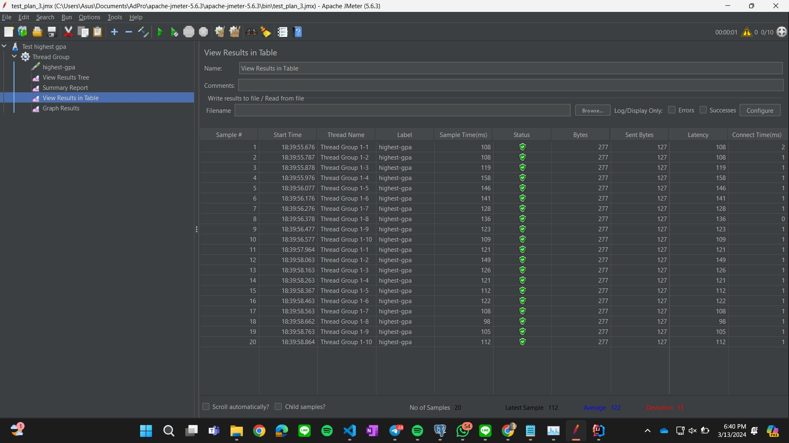
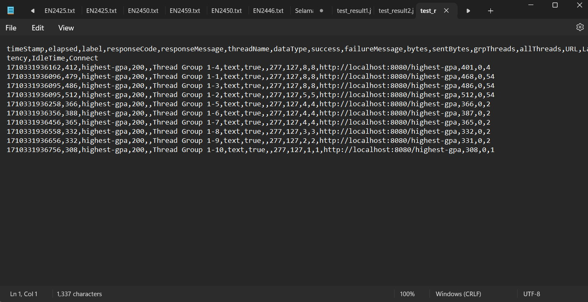
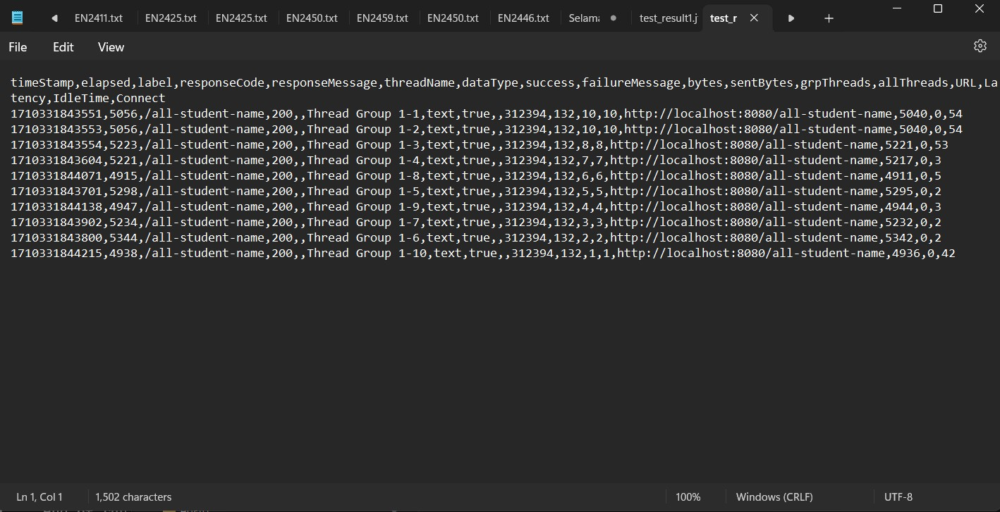
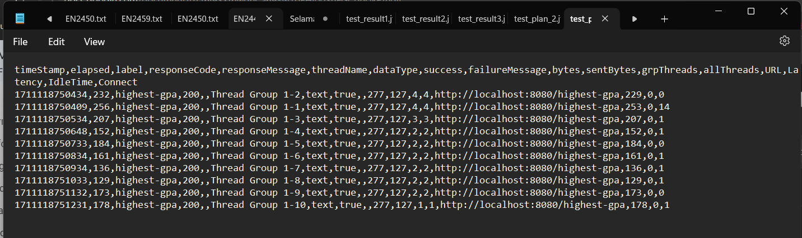
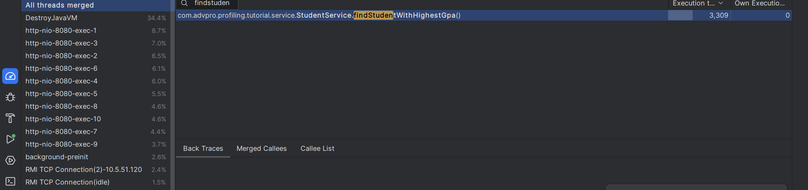
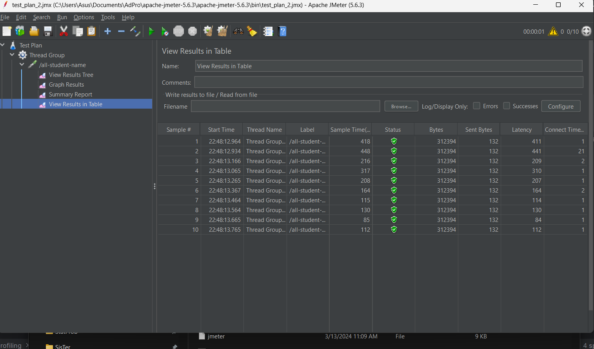
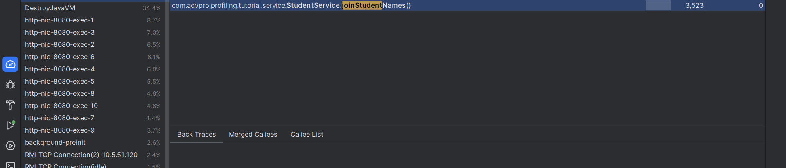
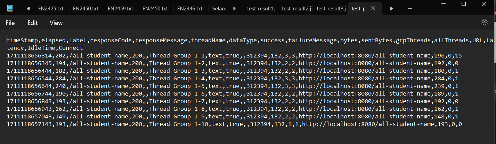

# TUTORIAL 5 ADPRO  (Java Profiling)
#### Daffa Mohamad Fathoni (2206824161)
#### Advanced Programming B / GEN

## Results of JMeter Test Plan & Profiling
### 1. Before Optimizing
*highest_gpa*

*all-student_name*

### 2. After Optimizing
*highest_gpa*

*all-student_name*

### Conclusion
Setelah Optimisasi kode, pada ketiga endpoint terdapat penurunan execution time yang cukup signifikan. Hal ini dapat dilihat baik pada hasil uji JMeter maupun hasil uji Profiling Intellij.
## REFLECTION

**1. What is the difference between the approach of performance testing with JMeter and profiling with IntelliJ Profiler in the context of optimizing application performance?**

Pengujian kinerja dengan JMeter berfokus pada simulasi aktivitas pengguna untuk mengukur kinerja aplikasi, seperti waktu tanggapan, throughput, dan penggunaan sumber daya, yang membantu mengidentifikasi area yang memerlukan perbaikan. Pendekatannya lebih pada mengukur output tanpa menyelami detail internal aplikasi. Sebaliknya, profilisasi dengan IntelliJ Profiler melakukan analisis mendalam terhadap cara kerja aplikasi, memungkinkan deteksi fungsi atau bagian kode yang memperlambat kinerja, serta analisis penggunaan memori dan CPU secara detail. Ini memfasilitasi optimasi yang lebih terarah dengan memperbaiki bagian kode yang paling berpengaruh terhadap kinerja.

**2. How does the profiling process help you in identifying and understanding the weak points in your application?**

Profilisasi memberikan wawasan tentang perilaku aplikasi selama eksekusi dengan memantau aspek-aspek seperti penggunaan CPU, alokasi memori, invokasi metode, dan aktivitas thread. Melalui analisis data ini, pengembang dapat mengidentifikasi masalah efisiensi, penyumbat (bottlenecks), dan penggunaan sumber daya yang tidak perlu. Alat profilisasi menawarkan visualisasi dari eksekusi aplikasi, memudahkan penemuan bagian kode yang problematik dan memungkinkan intervensi yang tepat guna mengoptimalkan kinerja.

**3. Do you think IntelliJ Profiler is effective in assisting you to analyze and identify bottlenecks in your application code?**

Ya, IntelliJ Profiler sangat berguna bagi developer untuk menganalisis dan mengidentifikasi masalah dalam kode aplikasi mereka.
Sebagai contoh, dalam tutorial dan latihan pada modul 5 ini, pengguna dapat melihat bahwa beberapa metode memiliki kinerja yang lebih lambat.
Dengan melihat informasi tentang durasi baris yang disediakan oleh profiling, pengembang dapat dengan cepat menemukan bagian program yang menyebabkan keterlambatan atau hambatan.

**4. What are the main challenges you face when conducting performance testing and profiling, and how do you overcome these challenges?**

Salah satu tantangan besar adalah memahami dan menganalisis hasil dari pengujian kinerja untuk membandingkan performa sebelum dan sesudah optimisasi. Ini membutuhkan pemeriksaan yang cermat terhadap data kinerja, namun esensial untuk meningkatkan kemampuan dalam mengevaluasi dan memperbaiki kinerja aplikasi yang dikembangkan.

**5. What are the main benefits you gain from using IntelliJ Profiler for profiling your application code?**

Menggunakan IntelliJ Profiler memberikan kemudahan karena terintegrasi langsung dengan IDE, sehingga tidak perlu mengandalkan aplikasi pihak ketiga. Hal ini memungkinkan pengembang untuk langsung melihat dan menguji kode/metode yang berpotensi menjadi masalah tanpa meninggalkan lingkungan pengembangan mereka.

**6. How do you handle situations where the results from profiling with IntelliJ Profiler are not entirely consistent with findings from performance testing using JMeter?**

Saya belum mengalami ketidaksesuaian antara kedua alat tersebut. Namun, bila terjadi perbedaan, langkah pertama adalah mengevaluasi kembali skenario pengujian dan metodologi yang digunakan oleh kedua alat untuk memastikan bahwa perbedaan tersebut bukan berasal dari variabel pengujian. Penting juga untuk membandingkan metrik yang diukur oleh kedua alat dan memperhatikan perbedaan dalam konfigurasi perangkat keras atau lunak yang mungkin mempengaruhi hasil.

**7. What strategies do you implement in optimizing application code after analyzing results from performance testing and profiling? How do you ensure the changes you make do not affect the application's functionality?**

Setelah menganalisis hasil dari pengujian kinerja dan pembuatan profil, beberapa strategi dapat diterapkan untuk meningkatkan
kinerja kode aplikasi. Saya akan memulai dengan meninjau durasi eksekusi program yang diukur menggunakan JMeter.
Jika saya menemukan bahwa waktu eksekusi terlalu lama, langkah selanjutnya adalah mengidentifikasi bagian kode yang
menjadi penyebab masalah dan melakukan optimasi. Saya selalu memastikan bahwa perubahan yang saya lakukan tidak memengaruhi
fungsionalitas aplikasi dengan membandingkan output sebelum dan sesudah perubahan tersebut.